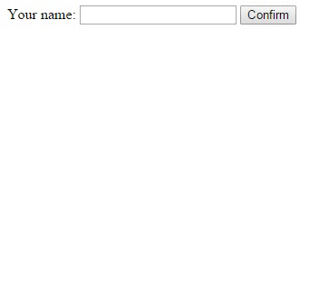

# Hello Notify

### Description:
**Hello Notify** is a **AngularJs Module** to create a flash notify.



### Require:
Only **AngularJS**, no more anything.

### How to use:

#### First of all

Include module files in your HTML

```html
<script src="module/hello-notify.js"></script>
<link rel="stylesheet" href="module/hello-notify.css">
```

#### In your javascript

- Simple use

```javascript
angular.module('app', ['hello-notify']);

angular.module('app')
    .controller('mainCtrl', mainCtrl);


mainCtrl.$injector = ['notify'];


function mainCtrl(notify) {
    var self = this;

    self.showNotify = function(message) {
        // where message is a string
        notify.notify(message);
    };
})
```

- Use template

Maybe you will need custom notify, you can create a template in your HTML, like this:

```html
<div id="imTemplate" style="display: none;">
    
    This is a template example
</div>
```

In your javascript:

```javascript
    self.showNotify = function() {
        notify.notify({
            template: '#imTemplate'
        });
    };
```

- Maintain Angular Bindings

If you need create a notify where contain Angular baindings, and it's important for you, like binding text, button click, etc, is necessary use **element** property in parameter:

```html
<div id="imTemplate" style="display: none;">
    Are you sure?
    <button ng-click='main.yes()'>Just Do It!!</button>
    <button ng-click='main.no()'>No</button>
</div>
```

In your javascript:

```javascript
    self.showNotify = function() {
        notify.notify({
            element: '#imTemplate'
        });
    };
```

### Parameters:

```javascript
    notify.notify({
        hoverClass: 'elementHover'
        , class:    'pointer color_blue'
        , element:  '#imTemplate'
        , template: '#imTemplate'
        , message:  'Hello World!'
        , click:    function(li) {
            notify.remove(li);
        }
    });
```

#### Descriptions:
I'm coming!!!